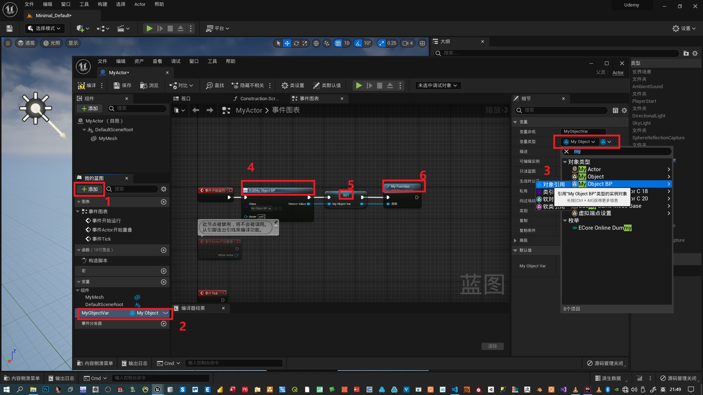
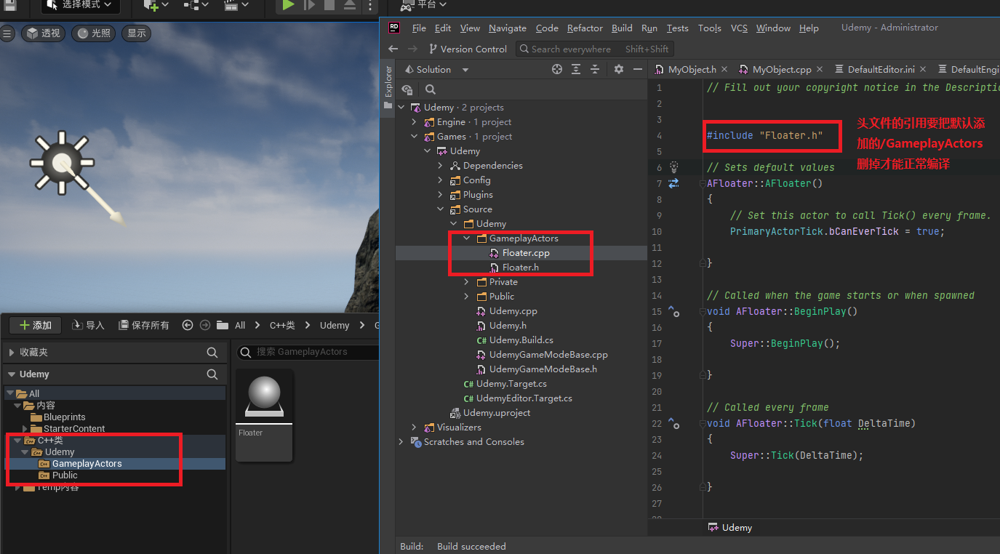

1. 虚幻引擎类之前的"A"和"U"，

2. 在创建的.CPP文件里（这里我们用Character类做例子）第一行是类的构造函数，然后是BeginPlay，Tick和SetupPlayerInputComponent。 这里每个方法前的Super代表的是调用父类里的方法。 我们可以在.h头文件里，找到继承的ACharacter，然后观察里面的BeginPlay方法等。

3. 如果新创建的类编译不成功，尝试进入项目文件夹下删除saved, Intermediate,Binaries,然后右键.uproject文件，重新生成Visual Studio Project,然后重新编译。

4. 如果创建一个继承自Object的对象，那么默认是不能通过蓝图来创建一个继承它的类的。需要做的是在ULASS(blueprintable)函数中传递blueprintable参数，并重新编译就可以了。
    - 创建的变量需要用UPROPERTY()来标记，并且还要传递BlueprintReadWrite参数，注意变量需要用Public：来修饰作用域
    - 创建的函数需用用UFUNCTION()，并且要传递BlueprintCallable参数
### Using UObject in Blueprints 在蓝图中使用UObject
---
    - 可以在对UPROPERTY传递参数的时候对变量进行分类比如：
        - UPEROPERTY(BlueprintReadWrite, Category = "MyVariables") 
        - UFUNCTION(BlueprintCallable, Category = "MyFuncions")

**下面是在Unreal Engine中创建的继承于Object的类**

MyObject.h头文件
```c++
#pragma once
#include "CoreMinimal.h"
#include "UObject/NoExportTypes.h"
#include "MyObject.generated.h"

UCLASS(Blueprintable)
class UDEMY_API UMyObject : public UObject
{
	GENERATED_BODY()
public:	
	UMyObject();

	UPROPERTY(BlueprintReadWrite,Category = "MyVariables")
	float myFloat;

	UFUNCTION(BlueprintCallable, Category = "MyFunctions")
	void MyFunction();   
}
```
MyObject.cpp源文件
```c++
#include "MyObject.h"

UMyObject::UMyObject()
{
	myFloat = 0;
}

void UMyObject::MyFunction()
{
	UE_LOG(LogTemp,Warning,TEXT("This is our warning test"));
	
}
```
创建之后我们就可以在蓝图中创建一个继承于MyObject的类，使用Create Blueprint class based on MyObject

**需要注意的是我们需要在蓝图中实例化类，并赋值给MyObject的变量，才能引用类里的方法或者变量如下图：**

### 在不同文件夹下创建类的时候，要手动修改头文件的引用位置：  
---
- 如下图，UCLASS()并没有添加Blueprintable参数，但是我们可以直接创建Floater的蓝图类，原因是Floater类继承于AActor，AActor使用了UCLASS并且传递了Blueprintable参数！  


### Component组件初步介绍
Component是特殊的UObject类。用在Actors类里的Subobject，用来增加actor的一些功能。所有的Actors都有一个默认的组件->scene component，也就是你创建完蓝图类后看到的DefaultSceneRoot，如果点击这个组件，你可以看到它的一些细节，这一组件并没有视觉上的功能，你并不能在游戏中看到它。
如果你有更好的相关资料可以在留言里附上链接！感谢！
<figure>
	<blockquote>
		<p>This is just test!</p>
		<footer>
			<cite>Please Leave a Comment Below if You Have Any Questions! Cheers!</cite>
		</footer>
	</blockquote>
</figure>


