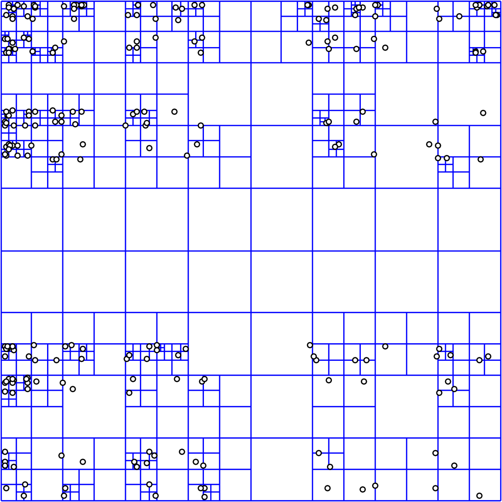
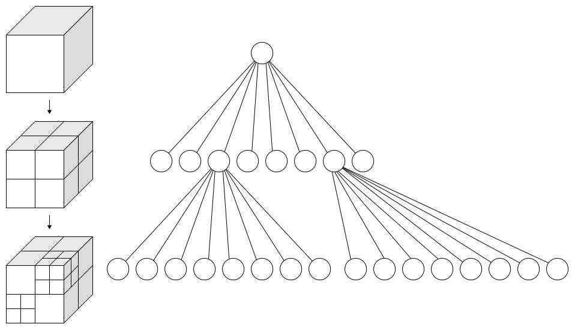

这应该是一篇Prograssive的，渐进更新的一篇文章，原因是我对Octree丝毫不了解，刚开始看到的肯定不全面不深入。所以会通过以后的学习了解进而回过头来对这篇文章进行修改。所以我会把这篇文章，各个部分做上时间标签。

通过一段时间的了解学习，还有和虚幻引擎体素插件作者的请教，我初步选定Octree作为块模型的渲染算法（这一算法同样是Surpac和Leapfrog使用的，目前只有这两款软件可以轻松的渲染上千万级以上的块。其他软件都会很卡，在相同的硬件情况下）首先需要做一个最初步的Octree介绍！

#### 首先的建议是对树形数据结构有基本了解，通过抽象对比来加深理解：
一维情况下我们有二分法的思想，二分法的关键点是要理解边界条件的定义！这一点同样会延伸到二维情况下的二分法和三维情况下的二分法！二分法的本质是快速排除掉元素的另一半，如何进行区间的划分是最重要的一个环节！是以两个最小单元来划分元素位置。

二维情况下我们需要对X和Y两个维度进行二分，所以就产生了四叉树。所以四叉树的本质是以四个最小单元来划分元素的位置。如下图

三维情况下我们需要对X，Y和Z三个维度进行二分，所以就产生了八叉树。所以八叉树的本质是以八个最小单元来划分元素。（不一定是位置信息）如下图

<figure>
	<blockquote>
		
This is just test!

		<footer>
			<cite>Please Leave a Comment Below if You Have Any Questions! Cheers!</cite>
		</footer>
	</blockquote>
</figure>

