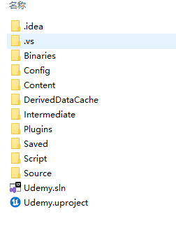

UE5基础知识5主要是包括了对项目文件的一个简单介绍。  

在进入主题之前插入一个关于博客搭建的小知识，我在把GitHub上的博客克隆到另一个电脑上进行NPM install的时候卡reify:rxjs: timing reifyNode:node_modules/@ 在这个地方。后来换了网络也不行最后通过修改镜像安装成功的：  

```npm
npm set registry https://registry.npmmirror.com/

```

**下面进入正题**
---
### 文件目录说明以及作用


Binaries：（可删除）存放编译生成的结果二进制文件。该目录可以gitignore,反正每次都会生成。  
Config：（不可删除）配置文件。  
Content：（不可删除）平常最常用到，所有的资源和蓝图等都放在该目录里。    
DerivedDataCache：（可删除）“DDC”，存储着引擎针对平台特化后的资源版本。比如同一个图片，针对不同的平台有不同的适合格式，这个时候就可以在不动原始的uasset的基础上，比较轻易的再生成不同格式资源版本。gitignore。  
Intermediate：（可删除）中间文件（gitignore），存放着一些临时生成的文件。有：
- Build的中间文件，.obj和预编译头等
- UHT预处理生成的.generated.h/.cpp文件
- VS.vcxproj项目文件，可通过.uproject文件生成编译生成的Shader文件。
- AssetRegistryCache：Asset Registry系统的缓存文件，Asset Registry可以简单理解为一个索引了所有uasset资源头信息的注册表。CachedAssetRegistry.bin文件也是如此。  

Saved：（可删除，但不建议删除，如果确定项目没有问题，则可以删除）存储自动保存文件，其他配置文件，日志文件，引擎崩溃日志，硬件信息，烘培信息数据等。gitignore  
Source：（不可删除）代码文件。  
.vs：（可删除）C++智能提示等功能  
.sln：（可删除）C++工程  
.uproject：（不可删除）ureal工程  
Plugins：（不可删除）项目使用的插件文件加，项目中没有用到其它插件，这个文件夹就没有。  
标记可删除的文件夹/文件都是可以打开项目再次生成的，项目比较大的话重新生成的时间也会长，如果项目没有问题建议不删除。




### 将项目纳入版本控制需要上传的目录：
1. Config：
2. Content
3. Source：
4. .uproject:
5. Plugins:

### 如何从项目中彻底删除C++文件
1. 关闭项目： 退出UE5 编辑器

2. 删除源文件：在项目Source文件夹中删除对应的.h .cpp文件

3. 删除编辑器二进制文件： 删除项目Binaries文件夹

4. 重新生成Binaries文件夹： 鼠标右键.uproject --> Generate Visual Studio project files

5. 打开项目： 鼠标右键.uproject -->Open --> Launch game 或者用Epic Games Launcher打开项目文件


<figure>
	<blockquote>
		<p>This is just test!</p>
		<footer>
			<cite>Please Leave a Comment Below if You Have Any Questions! Cheers!</cite>
		</footer>
	</blockquote>
</figure>


