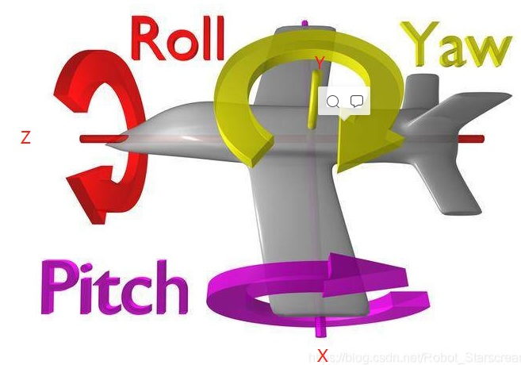

```cpp
void AAvatar::Yaw(float amount)
{
    if (Controller && amount)
    {
        // AddControllerYawInput()函数用于改变控制器的Yaw变量，即增加纵向轴旋转量。
        // GetWorld()函数取得世界指针UWorld*，通过世界指针调用GetDeltaSeconds()取得每帧耗费的时间。
        // 之所以要乘以每帧耗费的时间，是为了使得每一【秒】都增加200.0f * amount的改变量。
        // 如果不乘以每帧耗费的时间，那么每一【帧】都会增加200.0f * amount的改变量。（注意由于每秒渲染量不同，所以每秒的帧数不一定是固定的。）
        // 通过帧数来控制变量，那么游戏看起来就不那么流畅。试想，机子性能好的时候游戏角色动作就迅速，机子性能差的时候游戏角色动作就慢，这对于玩家公平吗？
        AddControllerYawInput(200.f * amount * GetWorld()->GetDeltaSeconds());
    }
}
```
### Yaw Pitch Roll
载体坐标系与载体坐标系的关系是三个Euler角：yaw，pitch，roll反应了载体相对基准面的姿态。  


1. pitch是围绕X轴旋转，也叫做俯仰角。当X轴的正半轴位于过坐标原点的水平面之上（抬头）时，俯仰角为正。

2. yaw是围绕Y轴旋转，也叫偏航角。即机头右偏航为正，反之为负。

3.  roll是围绕Z轴旋转，也叫翻滚角。机体向右滚为正，反之为负。



<figure>
	<blockquote>
		<p>This is just test!</p>
		<footer>
			<cite>Please Leave a Comment Below if You Have Any Questions! Cheers!</cite>
		</footer>
	</blockquote>
</figure>


